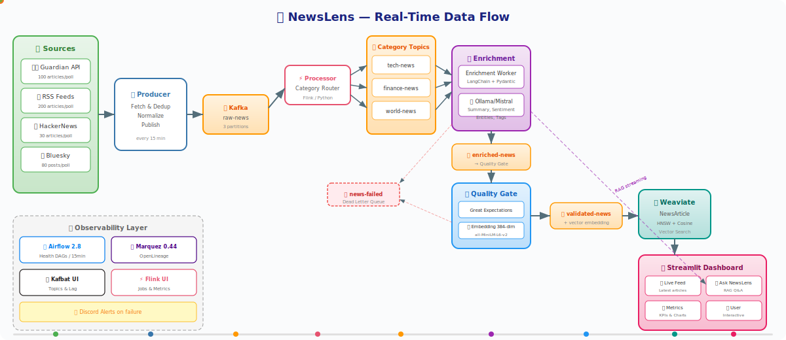
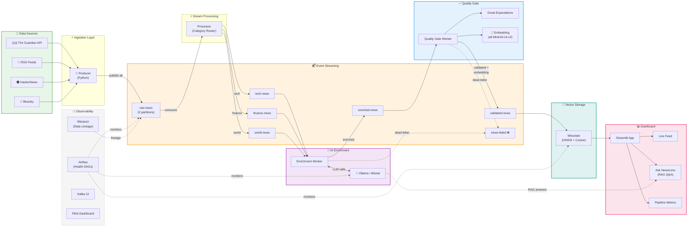
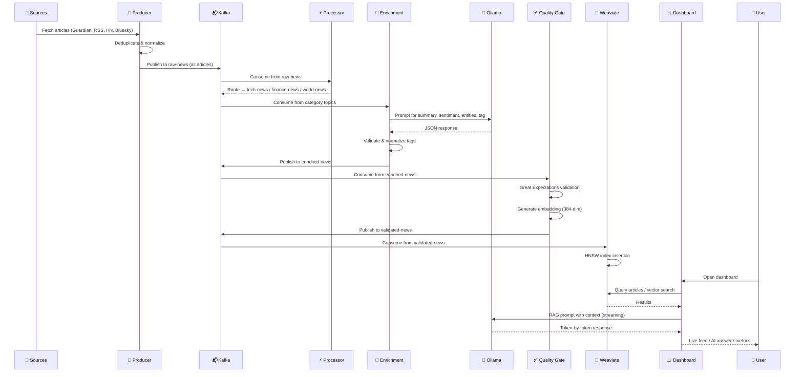

<p align="center">
  
</p>

<h1 align="center">🔍 NewsLens</h1>
<h3 align="center">Real-Time AI-Powered News Intelligence Pipeline</h3>

<p align="center">
  
  
  
  
  
  
  
  
</p>

<p align="center">
  <em>An end-to-end streaming pipeline that ingests news from multiple sources, enriches articles with AI (NLP + LLM), validates quality, stores in a vector database, and serves a real-time interactive dashboard with semantic search & RAG-powered Q&A.</em>
</p>

---

## 📐 Architecture — Animated Data Flow

<p align="center">
  
</p>

<p align="center"><em>↑ Watch the data flow through the pipeline in real-time (animated SVG — dots represent articles moving through stages)</em></p>

---

## 📐 Architecture — Static Diagram



---

## 🚀 Pipeline Stages — Step by Step

<table>
<tr>
<td width="80" align="center">

**Stage**
</td>
<td width="200">

**Component**
</td>
<td>

**What Happens**
</td>
</tr>

<tr>
<td align="center">

### 1️⃣
</td>
<td>


</td>
<td>

**Multi-Source Ingestion** — Polls The Guardian API, RSS feeds, HackerNews, and Bluesky every **15 minutes**. Deduplicates articles, routes to category-specific Kafka topics (`tech-news`, `finance-news`, `world-news`).
</td>
</tr>

<tr>
<td align="center">

### 2️⃣
</td>
<td>


</td>
<td>

**Event Streaming** — Apache Kafka (KRaft mode, no ZooKeeper) with 7 topics acts as the central nervous system. Decouples producers from consumers, enables replay, and provides backpressure handling.
</td>
</tr>

<tr>
<td align="center">

### 3️⃣
</td>
<td>


</td>
<td>

**AI Enrichment** — Enrichment worker consumes raw articles, calls **Mistral** (via Ollama) to generate: summary, sentiment analysis (Positive/Negative/Neutral + reason), entity extraction, and domain classification (AI, Crypto, Regulation, Geopolitics, Earnings, Climate, Cybersecurity, Other).
</td>
</tr>

<tr>
<td align="center">

### 4️⃣
</td>
<td>


</td>
<td>

**Validation + Embedding** — Validates enriched articles with Great Expectations (recency check, schema, completeness). Generates **384-dim vectors** using `all-MiniLM-L6-v2` sentence-transformer. Passes valid articles to `validated-news`; dead-letters failures.
</td>
</tr>

<tr>
<td align="center">

### 5️⃣
</td>
<td>


</td>
<td>

**Vector Storage** — Ingests validated articles into Weaviate's `NewsArticle` collection with HNSW cosine index. Enables lightning-fast semantic search and aggregation queries for the dashboard.
</td>
</tr>

<tr>
<td align="center">

### 6️⃣
</td>
<td>


</td>
<td>

**Interactive Dashboard** — Three views: **Live Feed** (latest articles with filters), **Ask NewsLens** (vector search + RAG Q&A with streaming LLM responses), **Pipeline Metrics** (KPIs, sentiment/tag/section charts, health links).
</td>
</tr>

<tr>
<td align="center">

### 7️⃣
</td>
<td>


</td>
<td>

**Observability** — Airflow runs health-check DAGs every 15 min (validates message flow, article counts, consumer groups, model availability). Marquez tracks OpenLineage metadata for full data lineage. Discord alerts on failure.
</td>
</tr>
</table>

---

## 🧬 Detailed Data Flow



---

## 🛠️ Tech Stack

| Layer | Technology | Purpose |
|-------|-----------|---------|
| **Ingestion** |  | Multi-source producer with deduplication |
| **Streaming** |  | Event backbone (KRaft, 7 topics) |
| **Processing** |  | Stream processing framework |
| **LLM** |  | Article enrichment & RAG answers |
| **Embeddings** |  | all-MiniLM-L6-v2 (384 dims) |
| **Validation** |  | Data quality checks |
| **Vector DB** |  | HNSW cosine similarity search |
| **Dashboard** |  | Interactive UI (Live Feed, Q&A, Metrics) |
| **Orchestration** |  | Health checks, scheduling, alerts |
| **Lineage** |  | OpenLineage metadata tracking |
| **Monitoring** |  | Topic inspection & consumer lag |
| **Infra** |  | 16 containerized services |

---

## 📂 Project Structure

```
newslens/
├── producer/                # 📡 Multi-source news fetcher (Guardian, RSS, HN, Bluesky)
├── enrichment/              # 🧠 LLM enrichment worker (Ollama/Mistral)
├── quality_gate/            # ✅ Great Expectations validation + embedding
├── weaviate_store/          # 💾 Weaviate ingestion consumer
├── dashboard/               # 📊 Streamlit app (Live Feed, Ask NewsLens, Metrics)
│   ├── app.py              #     Entry point & navigation
│   ├── views/              #     Page views (live_feed, ask_newslens, metrics)
│   ├── config.py           #     Environment-based configuration
│   ├── weaviate_helper.py  #     Weaviate query utilities
│   ├── Dockerfile          #     Optimized image (2.6 GB, CPU-only PyTorch)
│   └── tests/              #     Unit tests
├── airflow/
│   └── dags/               # 🔄 health_check DAG (message flow + consumer groups)
├── processor/               # ⚡ Flink stream processor
├── tests/                   # 🧪 Integration tests
├── docker-compose.yml       # 🐳 Full stack (16 services)
├── .env                     # 🔐 Configuration (poll interval, keys)
└── README.md                # 📖 You are here
```

---

## 🚦 Quick Start

```bash
# Clone
git clone https://github.com/intez20/newslens.git
cd newslens

# Configure
cp .env.example .env
# Edit .env with your Guardian API key, Discord webhook, etc.

# Launch all 16 services
docker compose up -d

# Pull Mistral model into Ollama
docker compose exec ollama ollama pull mistral

# Access the services
# 📊 Dashboard:       http://localhost:8501
# 📬 Kafka UI:        http://localhost:8080
# ⚡ Flink:           http://localhost:8081
# 🔄 Airflow:         http://localhost:8082
# 🔍 Marquez Lineage: http://localhost:3000
# 💾 Weaviate:        http://localhost:8085
```

---

## 📈 Pipeline Metrics at a Glance

| Metric | Value |
|--------|-------|
| **Sources** | 4 (Guardian, RSS, HackerNews, Bluesky) |
| **Poll Interval** | 15 minutes |
| **Kafka Topics** | 7 |
| **Embedding Dimensions** | 384 (all-MiniLM-L6-v2) |
| **Vector Index** | HNSW with cosine distance |
| **LLM** | Mistral 7B (via Ollama) |
| **Container Count** | 16 services |
| **Dashboard Image** | 2.6 GB (CPU-only PyTorch) |

---

## 🔐 Fault Tolerance

| Scenario | Handling |
|----------|----------|
| LLM returns invalid tag | Normalized to `"Other"` (no dead-letter) |
| Article older than 7 days | Dead-lettered by Quality Gate |
| Service down | Airflow detects in ≤15 min → Discord alert |
| Consumer crash | Kafka consumer group rebalances automatically |
| Weaviate unreachable | Ingestion retries with exponential backoff |

---

<p align="center">
  
</p>
